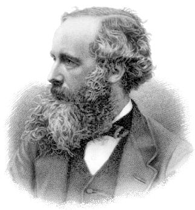
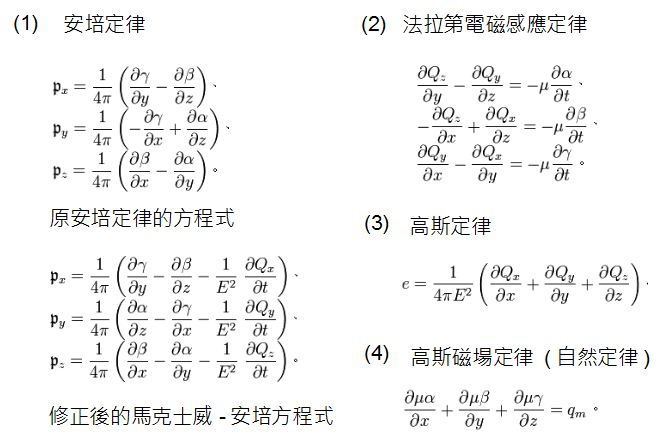
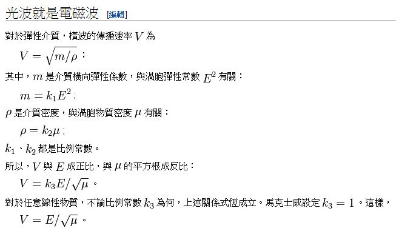
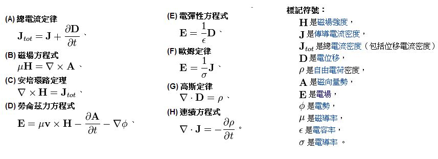
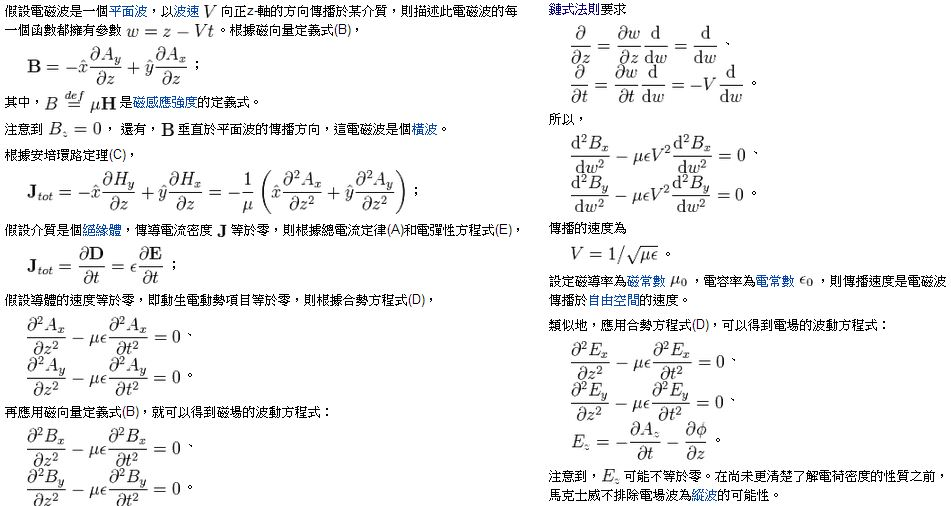
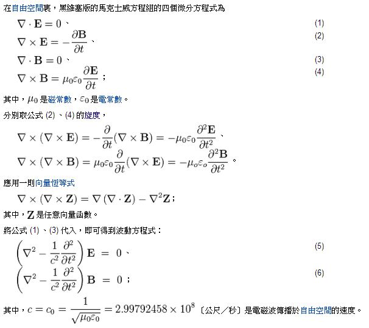

## 電磁學大師：詹姆斯·馬克士威 (James Clerk Maxwell)

詹姆斯·馬克士威（英語：James Clerk Maxwell，1831年6月13日－1879年11月5日）是英國理論物理學家和數學家，雖然才華洋溢，
但卻英年早逝，只活了短短的四十八年。

學過物理學的人，通常會知道「馬克士威方程式」，而且知道這是電磁學領域的集大成之作。但是、到底「馬克士威」是何許人也，
他這輩子又做過哪些事情呢？

### 年輕時代

馬克士威八歲時母親因癌症病逝，還好父親對他很好，十歲時進入愛丁堡學院就讀，並認識終身的好朋友 Tait，十四歲時在愛丁堡
皇家學會發表第一篇論文：「論橢圓的製圖法」，展現了其數學天賦。
 
十六歲時，馬克士威與 Tait 兩人一起進入愛丁堡大學就讀，三年後又進入劍橋大學三一學院 (Trinity College)，後來成為三一學院的研究員。

### 馬克士威與法拉第

說來也巧，馬克士威出生的　1831 年，正是法拉第提出電磁感應定理的那年。

後來、馬克士威注意到法拉第的研究，閱讀了 [Experimental Researches in Electricity] 這本書，於是深深的著迷了。

25 歲時，馬克士威年發表了一篇論文，名稱為 [論法拉第力線] (On Faraday's Lines of Force)，於是將這篇論文寄給法拉第看。
隔年、64 歲的法拉第回了一封信給 24 歲的馬克士威，說到下列這段話。

> ... I was at first almost frightened when I saw such mathematical force made to bear upon the subject, and then wondered to see that the subject stood it so well. ....

翻譯成中文就是：「當我看到你論文中的那些數學，我幾乎是被嚇到了。但是很好奇你為何會將這個主題做得這麼好 ...」，

在那時期的電磁學可以形容為眾多實驗結果和數學分析的大雜燴，急需整合成一套內外一致，有條有理的學術理論。
法拉地的數學背景不夠強，無法完成這件任務，結果馬克士威漂亮的完成的這個任務，成為電磁學領域的大師。

到底、馬克士威在 [論法拉第力線] 這篇論文裏寫了甚麼呢？維基百科裏有中文的摘要版，讓我們稍微的看看這篇
經典論文的內容與時代背景。

### 馬克士威的論文：論法拉第力線 (1855年)

馬克士威將法拉第想出的力線延伸為裝滿了不可壓縮流體的「力管」。這力管的方向代表力場（電場或磁場）的方向，
力管的截面面積與力管內的流體速度成反比，而這流體速度可以比擬為電場或磁場。

然後、透過借用「威廉·湯姆森」等人在流體力學的一些數學框架，馬克士威推導出一系列初成形的電磁學雛論。

像是在「傅立葉熱傳導定律」裏有下列的公式：

  

其中，    是熱通量（heat flux），k 是物質的熱導率，T 是溫度。

如果將這樣個概念套用到電磁學領域中，電場和電勢之間的關係式可表達為

  

其中，E 是電場，\phi 是電勢。

很明顯地，設定熱導率 k=1，則電勢可以比擬為溫度，而電場可以比擬為熱通量。

法拉第的電力線變為了熱流線，等勢線（equipotential）變為了等溫線。所以，解析熱傳導問題的方法，可以用來解析靜電學問題。

馬克士威又注意到一個問題：熱傳導依賴的是物質的緊鄰的兩個粒子之間互相接觸而產生的「鄰接作用」（contiguous action）；

思考兩個相距很遠的電荷，不經過任何媒介，互相直接施加於對方的作用力，假若電場力是這種作用力，則電場力是一種超距作用
（action at a distance）。兩種完全不同的物理現象，居然可以用同樣形式的數學方式來描述，這給予馬克士威很大的遐想空間。

然後、透過這樣的比擬（將源電荷 q 比擬為力管源，將電場比擬為流速），馬克士威越推論越深遠，結果得到了「庫倫定律」與
「高斯定律」等電學的基本公式。

   

  

  

但是、這篇論文還不是很成熟，而且、接下來的幾年，馬克士威暫時沒有這方面的論文，反而走向光學領域去了。

### 土星光環與彩色照片

1856 年，馬克士威因父親生病，申請調回 Marischal 學院任教，並於這時期完成土星光環的研究而得到 Adams 獎，該研究結論
是土星光環應該是由小碎塊所構成，不可能是整塊固體，也不可能是純粹液體 (這點在卡西尼-惠更斯號於 2006 年 9 月 15 日拍得的土星環全貌後被證實了)。

接著、馬克士威還利用在陀羅上塗色並旋轉的方式，證明大多數顏色可用「紅綠藍」三原色混合而成，並在 1861 年製作出了全世界
第一張彩色照片。

在完成這些光學研究後，馬克士威又回到了電磁學領域繼續努力，在 30 歲的那年，又發表了一篇重要的電磁學論文「[論物理力線]」 
(On Physical Lines of Force)。

### 馬克士威的論文：論物理力線 (1861年)

在 [論物理力線] 這篇論文裏，馬克士威提出了力線 (或稱場線) 這樣的概念，這種力線可以描述「電力、磁力、重力」所形成的
力場，並且透過微積分的數學原理，計算這些力場的強度。

在這篇文章中，馬克士威對自己在 [論法拉第力線] 時想出的分子渦流模型，提出了幾點質疑，並且他假設在兩個相鄰渦胞之間，
有一排微小圓珠，將這兩個渦胞隔離分開。這些圓珠只能滾動（rolling），不能滑動。圓珠旋轉的方向相反於這兩個渦胞的旋轉方向，
這樣，就不會引起摩擦。

然後、馬克士威透過這種改良的分子渦流想法，推論出一些數學公式，以下是幾個範例：

>   
> 
> 其中，    是流體的密度，是一個常數。
> 
>   
> 
> 其中，R 是渦胞的半徑，   是流體位於周邊的周邊速度。

從這模型，經過一番複雜的運算，馬克士威能夠推導出安培定律、法拉第感應定律等，這也就是後來被稱為「馬克士威方程組」的那些公式。

但是、事實上馬克士威所用的方程式並沒有像後來用散度與旋度表示的數學這麼漂亮，而是如下所示的一大堆方程式

(評論：不過說真的，其實已經很漂亮了，只是沒有加上「散度、旋度」這種總合算子的包裝而已)。

然後、馬克士威從彈性物質會以波動形式傳播能量於空間，聯想到電磁場應該也會以波動形式傳播能量於空間，並且會產生反射，折射等等波動行為。
於是馬克士威計算出電磁波的傳播速度，發覺這數值非常接近於光速。因此，馬克士威認為光是一種電磁波。以下是摘自維基百科 [論物理力線] 文章
中的推論。

於是馬克士威在論文中寫下了一段話，翻譯成中文如下。

> 根據韋伯和科爾勞施完成的電磁實驗，在我們的假想介質裏的橫向波盪的速度，與從斐索的光學實驗計算求得的光速，是如此精確地符合，這使我們難以排除如下的推論：光是由引起電現象和磁現象的同一介質中的橫波組成的。
> ——馬克士威，於《論物理力線》

不過、在這篇文章中馬克士威也擁有了一些後來被認為不夠好的想法，像是他認為完美真空不存在，乙太瀰漫於整個宇宙。與普通物質不同，馬克士威
假想的乙太具有能量與動量，因此可以說具有質量，但是牛頓萬有引力定律不適用於它，因為它沒有重量。

### 馬克士威的論文：電磁場的動力學理論 (1864年)

在這篇論文的標題為電磁場一般方程式的第三章裏，馬克士威列出了涉及二十個未知量的二十個方程式，在那時期，稱為馬克士威方程組。
由於向量微積分尚在發展中，這二十個方程式都是以分量形式表示，其中，有十八個方程式可以用六個向量方程式集中表示（對應於每一個直角坐標，
有一個方程式），另外剩下的兩個是純量方程式。所以，以向量標記，馬克士威方程組可以表示為八個方程式。如下所示：

馬克士威在對於光波是一種電磁現象的推導裏，並沒有使用法拉第電磁感應定律，而是使用方程式(D)來解釋電磁感應作用。

以下是馬克士威原始版的推導過程：

1884年，從這八個方程式，奧利弗·黑維塞重新編排出四個方程式，並且稱這一組方程式為馬克士威方程組。今天廣泛使用的馬克士威方程組就是黑維塞編成的這一組方程式。

黑維塞版本的馬克士威方程組是以現代向量標記法寫出。在原先版本的八個方程式裏，只有一個方程式，高斯定律的方程式(G)，完整不變地出現於黑維塞版本。
另外一個在黑維塞版本的方程式，乃是由總電流定律的方程式(A)與安培環路定理的方程式(C)共同湊合而成。這方程式包含了馬克士威的位移電流，是安培環路定理的延伸。

以下是現代所用的黑維塞版推導過程：

### 結語

從以上三篇電磁學論文，我們可以看到，馬克士威的主要貢獻是建立了馬克士威方程組，創立了古典電動力學，並且預言了電磁波的存在，提出了光的電磁說。
所以說馬克士威是電磁學理論的集大成者。

另外、這三篇論文的出版時間橫跨了九年，再加上第一篇論文的醞釀期，馬克士威在這組方程式上所下的功夫，恐怕遠超過十年以上。

對於一個劍客而言，花費「十年磨一劍」的功夫，只是為了等待那「十步殺一人」的重要時刻，但是對於一個研究者而言，花費「十年磨一劍」
的原因，通常是為了要發現隱藏在事物背後更深層的秘密。

馬克士威的十年，並沒有磨出任何一把劍，但卻磨出了整個近代科學的「易筋經」，從此整個工業宛如「脫胎換骨」一般，從機械的
世界跨入到「電磁學」的世界當中，那十二個方程式，就是整個現代工業的至高無上的「武功祕笈」。

只要練成這種武功，你可以「隔空殺人」，也可以用「內力煮一頓晚餐」，只要你有「電磁波」就行了。於是、我們有了「電磁爐與電磁炸彈」，
以及更多的現代電磁設備，整個高科技領域的秘密，幾乎都蘊含在這十二個方程式當中。

難怪、1931年愛因斯坦在馬克士威百年誕辰的紀念會上，評價馬克士威的建樹「是牛頓以來，物理學最深刻和最富有成果的工作」。

### 參考文獻
* Wikipedia:[James Clerk Maxwell](http://en.wikipedia.org/wiki/James_Clerk_Maxwell)
* 維基百科：[馬克士威方程組](http://zh.wikipedia.org/zh-tw/%E9%BA%A6%E5%85%8B%E6%96%AF%E9%9F%A6%E6%96%B9%E7%A8%8B%E7%BB%84)
* 維基百科：[詹姆斯·克拉克·馬克士威](http://zh.wikipedia.org/wiki/%E8%A9%B9%E5%A7%86%E6%96%AF%C2%B7%E5%85%8B%E6%8B%89%E5%85%8B%C2%B7%E9%BA%A6%E5%85%8B%E6%96%AF%E9%9F%A6)
* 維基百科：[論法拉第力線]
* 維基百科：[論物理力線]
* 維基百科：[電磁場的動力學理論]
* 維基百科：[麥克斯韋關係式](http://zh.wikipedia.org/wiki/%E9%BA%A6%E5%85%8B%E6%96%AF%E9%9F%A6%E5%85%B3%E7%B3%BB)
* 維基百科：[馬克士威–波茲曼分布](http://zh.wikipedia.org/wiki/%E9%BA%A6%E5%85%8B%E6%96%AF%E9%9F%A6%E9%80%9F%E5%BA%A6%E5%88%86%E5%B8%83%E5%BE%8B)
* [法拉第以高明的科學想像力，體認到電荷之間的場才是描述電磁現象的關鍵。](http://case.ntu.edu.tw/sts/?tag=%E9%A6%AC%E5%85%8B%E5%A3%AB%E5%A8%81)
* Wikiquote:[Michael Faraday](http://en.wikiquote.org/wiki/Michael_Faraday)
* [On Faraday's Lines of Force (PDF)](http://www.ffn.ub.es/luisnavarro/nuevo_maletin/Maxwell_1856_Faraday_lines_excerpt.pdf)
* [馬克士威 James clerk Maxwell 的科學與詩](http://fang500301.blogspot.tw/2012/06/james-clerk-maxwell.html)
* [Experimental Researches in Electricity], Volume 1, by Michael Faraday, The Project Gutenberg eBook.
* 維基百科：[土星環](http://zh.wikipedia.org/wiki/%E5%9C%9F%E6%98%9F%E7%92%B0)
* [College Physics], OpenStax College.

[論法拉第力線]:http://zh.wikipedia.org/wiki/%E8%AB%96%E6%B3%95%E6%8B%89%E7%AC%AC%E5%8A%9B%E7%B7%9A
[論物理力線]:http://zh.wikipedia.org/wiki/%E8%AB%96%E7%89%A9%E7%90%86%E5%8A%9B%E7%B7%9A
[電磁場的動力學理論]:http://zh.wikipedia.org/wiki/%E9%9B%BB%E7%A3%81%E5%A0%B4%E7%9A%84%E5%8B%95%E5%8A%9B%E5%AD%B8%E7%90%86%E8%AB%96
[Experimental Researches in Electricity]:http://www.gutenberg.org/files/14986/14986-h/14986-h.htm

【本文由陳鍾誠取材並修改自 [維基百科] 與 OpenStax College 的 [College Physics] 一書，採用創作共用的 [姓名標示、相同方式分享] 授權】

